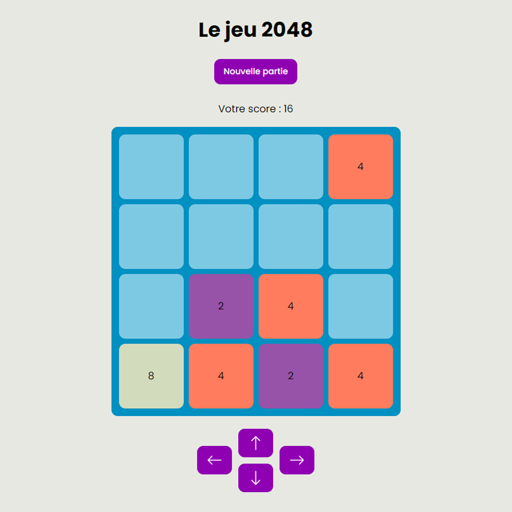

# Le Jeu 2048 en PHP [projet universitaire]  

TP n°2 de l'UE [LIFRW : Introduction aux Réseaux et au Web](http://perso.univ-lyon1.fr/olivier.gluck/supports_enseig.html#LIFRW) réalisé lors de ma première année de prépa intégrée à [Polytech Lyon](https://polytech.univ-lyon1.fr/)

## Objectif

Réaliser le jeu 2048 en PHP en respectant une organisation bien précise et détaillée dans le TP :  
- la page d'accueil est un fichier `.html` qui renvoie sur le jeu php au clic du bouton "Nouvelle partie"
- le score de la partie en cours, le contenu de la grille et l'historique des actions du joueur sont stockés dans des fichiers `.txt` côté serveur 
- le jeu est jouable avec des boutons sur la page
- le jeu affiche un message quand la partie est perdue
- de nombreuses indications sont données sur la manière de coder le jeu et notamment de gérer la grille et le déplacement des cases
- les règles doivent apparaître sur la page

## Ajouts personnels  

- Refonte complète du CSS pour rendre le jeu plus moderne et plus agréable visuellement
- Prise en charge du clavier pour jouer (flèches directionnelles)

## Inconvénients  

- En l'état, il n'est pas possible de jouer à plusieurs en même temps, la sauvegarde étant unique et stockée côté serveur
- A chaque action du joueur le serveur est sollicité pour mettre à jour la grille, ce qui n'est pas optimal en terme de performances notamment pour un jeu en ligne

## Résultat    

Une copie du projet est hébergée [ici](https://projects.milobrt.fr/2048)